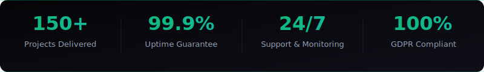
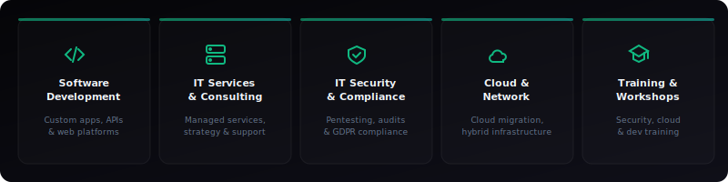
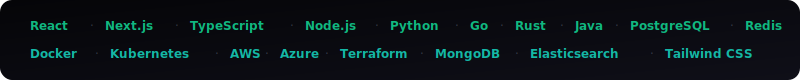

<picture>
  
</picture>

<br>

<p align="center">
  <a href="https://axisport.de"></a>&nbsp;
  <a href="mailto:kontakt@axisport.de"></a>&nbsp;
  <a href="https://axisport.de/de/kontakt"></a>
</p>

<br>

<picture>
  
</picture>

<br>

## 🏢 &nbsp; Wer wir sind

**Axis/Port.** ist ein deutsches IT-Unternehmen mit Sitz in Berlin — gegründet Anfang 2026 von **Nico** (Co-Founder & CSO) und **Kevin** (Co-Founder & CTO). Wir schließen die Lücke zwischen Technologie und Geschäftserfolg.

> *„Wir glauben daran, dass großartige Software durch Leidenschaft, Präzision und den richtigen Partner entsteht."*

Wir sind kein Dienstleister, der Tickets abarbeitet. Wir sind ein Partner, der mitdenkt, vorausplant und Verantwortung übernimmt — für IT-Lösungen, die nicht nur funktionieren, sondern Wachstum ermöglichen.

<br>

<picture>
  
</picture>

<br>

<picture>
  
</picture>

<br>

## ⚡ &nbsp; Was wir tun

<picture>
  
</picture>

<br>

<table>
  <tr>
    <td width="50%" valign="top">
      <h3>💻 &nbsp; Softwareentwicklung</h3>
      <p>Individuelle Software, Web-Applikationen, Mobile Apps und APIs — maßgeschneidert für Ihre Geschäftsprozesse. Von der ersten Idee zum fertigen Produkt mit agilen Methoden.</p>
      <ul>
        <li>Custom Software & Web Apps</li>
        <li>SaaS-Plattformen & Enterprise-Lösungen</li>
        <li>API-Entwicklung & Integration</li>
        <li>UI/UX Design & Prototyping</li>
      </ul>
    </td>
    <td width="50%" valign="top">
      <h3>🛡️ &nbsp; IT-Sicherheit</h3>
      <p>Cyberbedrohungen werden immer raffinierter. Wir schützen Ihr Unternehmen mit professionellem Penetration Testing, Security Audits und DSGVO-konformen Sicherheitslösungen.</p>
      <ul>
        <li>Penetration Testing & Security Audits</li>
        <li>DSGVO- & Compliance-Beratung</li>
        <li>Zero-Trust-Architektur</li>
        <li>Incident Response & SOC-Aufbau</li>
      </ul>
    </td>
  </tr>
  <tr>
    <td width="50%" valign="top">
      <h3>🖥️ &nbsp; IT-Dienstleistungen</h3>
      <p>Managed Services, strategische Beratung und 24/7-Support — wir übernehmen die Verantwortung für Ihre IT-Infrastruktur und sorgen für maximale Verfügbarkeit.</p>
      <ul>
        <li>Managed IT-Services & Monitoring</li>
        <li>IT-Beratung & Strategieentwicklung</li>
        <li>Helpdesk & 24/7 Support</li>
        <li>Systemadministration & Wartung</li>
      </ul>
    </td>
    <td width="50%" valign="top">
      <h3>☁️ &nbsp; Cloud & Netzwerk</h3>
      <p>Cloud-Migration, hybride Architekturen und professionelles Monitoring für maximale Verfügbarkeit und Performance Ihrer Infrastruktur.</p>
      <ul>
        <li>Cloud-Migration (AWS, Azure)</li>
        <li>Hybrid-Cloud & Netzwerkarchitektur</li>
        <li>Infrastructure as Code (Terraform)</li>
        <li>Disaster Recovery & Auto-Scaling</li>
      </ul>
    </td>
  </tr>
  <tr>
    <td width="50%" valign="top">
      <h3>🎓 &nbsp; Schulungen & Trainings</h3>
      <p>Praxisnahe Weiterbildung für Ihr Team — von Experten, die wissen, worauf es ankommt. Vor Ort, Remote oder Hybrid.</p>
      <ul>
        <li>IT-Security Awareness Trainings</li>
        <li>Cloud & DevOps Workshops</li>
        <li>Developer Schulungen</li>
        <li>Zertifizierungsvorbereitung</li>
      </ul>
    </td>
    <td width="50%" valign="top">
      <h3>🎨 &nbsp; Webdesign & SEO</h3>
      <p>Websites, die nicht nur atemberaubend aussehen, sondern auch Ergebnisse liefern. Datengetriebenes SEO für nachhaltiges Wachstum und Sichtbarkeit.</p>
      <ul>
        <li>Responsive & Mobile-First Design</li>
        <li>Performance-Optimierung (Core Web Vitals)</li>
        <li>SEO-Strategie & Monitoring</li>
        <li>Conversion-optimierte Landingpages</li>
      </ul>
    </td>
  </tr>
</table>

<br>

<picture>
  
</picture>

<br>

## 🛠️ &nbsp; Technologie-Stack

<picture>
  
</picture>

<br>

<p align="center">
  
  
  
  
  
  
  
  
</p>
<p align="center">
  
  
  
  
  
  
  
  
</p>
<p align="center">
  
  
  
  
  
  
</p>

<br>

<picture>
  
</picture>

<br>

## 🔒 &nbsp; Warum Axis/Port.?

<table>
  <tr>
    <td align="center" width="25%">
      <br>
      
      <br><br>
      <strong>Made in Germany</strong>
      <br>
      <sub>Alle Daten bleiben in Deutschland. BSI-Grundschutz, DSGVO-konform, deutsche Rechenzentren.</sub>
      <br><br>
    </td>
    <td align="center" width="25%">
      <br>
      
      <br><br>
      <strong>Maßgeschneidert</strong>
      <br>
      <sub>Jede Lösung wird individuell entwickelt — keine Templates, keine versteckten Kosten.</sub>
      <br><br>
    </td>
    <td align="center" width="25%">
      <br>
      
      <br><br>
      <strong>Immer erreichbar</strong>
      <br>
      <sub>Rund-um-die-Uhr-Überwachung, proaktive Wartung und ein dediziertes Team.</sub>
      <br><br>
    </td>
    <td align="center" width="25%">
      <br>
      
      <br><br>
      <strong>Schnell & Agil</strong>
      <br>
      <sub>Agile Methoden, kurze Iterationen — schnelle Lieferung ohne Qualitätsverlust.</sub>
      <br><br>
    </td>
  </tr>
</table>

<br>

<picture>
  
</picture>

<br>

## 👥 &nbsp; Die Gründer

<table>
  <tr>
    <td align="center" width="50%">
      <br>
      
      <br><br>
      <strong>Nico — Co-Founder & CSO</strong>
      <br><br>
      <sub>Stratege, Unternehmer und Antrieb hinter der Geschäftsentwicklung. Nico verbindet technisches Verständnis mit unternehmerischer Weitsicht und sorgt dafür, dass jedes Projekt nicht nur technisch exzellent, sondern auch geschäftlich erfolgreich ist.</sub>
      <br><br>
    </td>
    <td align="center" width="50%">
      <br>
      
      <br><br>
      <strong>Kevin — Co-Founder & CTO</strong>
      <br><br>
      <sub>Technischer Kopf mit Leidenschaft für sauberen Code, Sicherheitsarchitekturen und innovative Lösungen. Kevin treibt die technische Vision voran und stellt sicher, dass jede Zeile Code den höchsten Standards entspricht.</sub>
      <br><br>
    </td>
  </tr>
</table>

<br>

<picture>
  
</picture>

<br>

## 🚀 &nbsp; Unsere Mission & Vision

<table>
  <tr>
    <td width="50%" valign="top">
      <h3>🎯 &nbsp; Mission</h3>
      <p>Wir existieren, um die Lücke zwischen Technologie und Geschäftserfolg zu schließen. Jedes Unternehmen verdient IT-Lösungen, die nicht nur funktionieren, sondern Wachstum ermöglichen — sicher, skalierbar und zukunftsfähig.</p>
    </td>
    <td width="50%" valign="top">
      <h3>🔭 &nbsp; Vision</h3>
      <p>Wir bauen an einer Zukunft, in der jedes Unternehmen — unabhängig von seiner Größe — Zugang zu erstklassiger IT-Infrastruktur hat. Sicher, effizient und Made in Germany. Unser Ziel: Der führende IT-Partner für den deutschen Mittelstand.</p>
    </td>
  </tr>
</table>

<br>

## 💎 &nbsp; Was uns antreibt

<table>
  <tr>
    <td align="center" width="25%">
      <br>🛡️<br><br>
      <strong>Sicherheit zuerst</strong><br>
      <sub>Datenschutz und IT-Sicherheit sind kein Feature — sie sind unser Fundament.</sub>
      <br><br>
    </td>
    <td align="center" width="25%">
      <br>⭐<br><br>
      <strong>Kompromisslose Qualität</strong><br>
      <sub>Jede Zeile Code, jede Architektur erfüllt unsere höchsten Standards.</sub>
      <br><br>
    </td>
    <td align="center" width="25%">
      <br>👁️<br><br>
      <strong>Radikale Transparenz</strong><br>
      <sub>Offene Kommunikation, faire Preise, ehrliche Beratung.</sub>
      <br><br>
    </td>
    <td align="center" width="25%">
      <br>💡<br><br>
      <strong>Innovation als Antrieb</strong><br>
      <sub>Modernste Technologien für Lösungen, die auch morgen noch funktionieren.</sub>
      <br><br>
    </td>
  </tr>
</table>

<br>

<picture>
  
</picture>

<br>

## 📊 &nbsp; So arbeiten wir

```
 ╔══════════╗    ╔══════════╗    ╔══════════╗    ╔══════════╗    ╔══════════╗    ╔══════════╗
 ║    01    ║    ║    02    ║    ║    03    ║    ║    04    ║    ║    05    ║    ║    06    ║
 ║          ║ ─► ║          ║ ─► ║          ║ ─► ║          ║ ─► ║          ║ ─► ║          ║
 ║Discovery ║    ║Strategie ║    ║Umsetzung ║    ║ Testing  ║    ║  Launch  ║    ║ Betrieb  ║
 ╚══════════╝    ╚══════════╝    ╚══════════╝    ╚══════════╝    ╚══════════╝    ╚══════════╝

   Anforderungen     Roadmap &       Agile         Automatisierte   Zero-Downtime    24/7
   & Analyse       Architektur     Entwicklung      Tests & QA      Deployment     Monitoring
```

<br>

<picture>
  
</picture>

<br>

## 📬 &nbsp; Kontakt

<table>
  <tr>
    <td>🌐 &nbsp; <strong>Website</strong></td>
    <td><a href="https://axisport.de">axisport.de</a></td>
  </tr>
  <tr>
    <td>📧 &nbsp; <strong>E-Mail</strong></td>
    <td><a href="mailto:kontakt@axisport.de">kontakt@axisport.de</a></td>
  </tr>
  <tr>
    <td>📍 &nbsp; <strong>Standort</strong></td>
    <td>Berlin, Deutschland</td>
  </tr>
  <tr>
    <td>🕐 &nbsp; <strong>Erreichbarkeit</strong></td>
    <td>Mo–Fr: 09:00 – 18:00 Uhr | Support: 24/7</td>
  </tr>
</table>

<br>

<p align="center">
  <a href="https://axisport.de/de/kontakt">
    
  </a>
</p>

<br>

<picture>
  
</picture>

<br>

<p align="center">
  <sub>
    <strong>Axis/Port.</strong> GmbH · Berlin, Deutschland · © 2026
    <br>
    Entwickelt mit ♥ in Deutschland
    <br><br>
    
    &nbsp;
    
    &nbsp;
    
  </sub>
</p>
