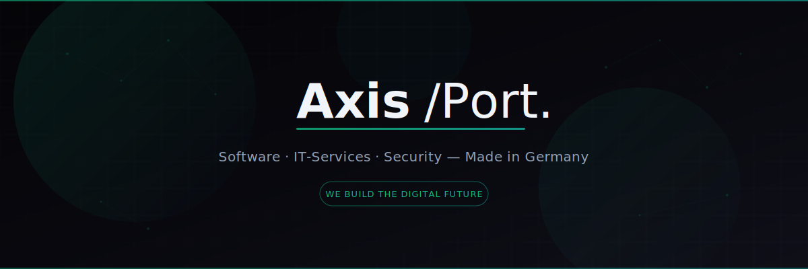
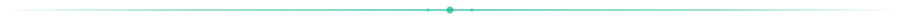
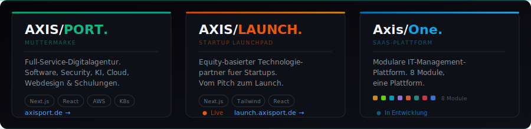
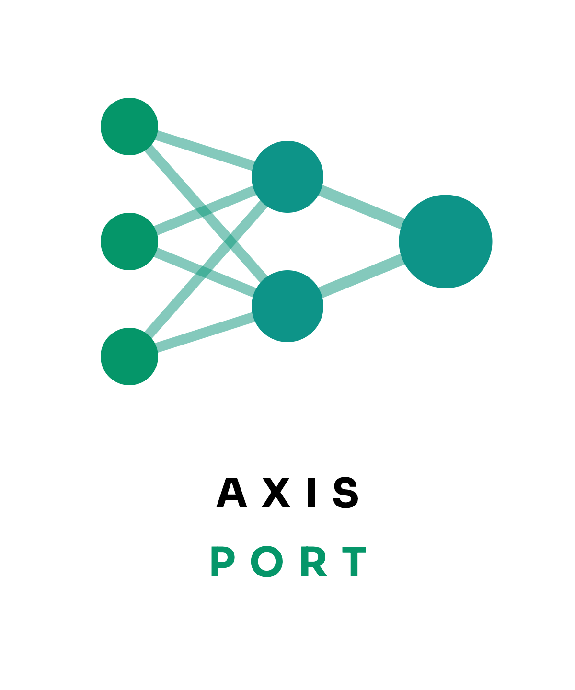

  <!-- Banner mit Logo, Tagline und Grid -->
  <picture>
    
  </picture>

 

Wir bauen Software, sichern Infrastruktur und integrieren KI. Gegründet 2026 in Schleswig-Holstein. Unter dem Dach von **AXIS/** entwickeln wir spezialisierte Produkte für unterschiedliche Märkte.

 

<picture>
  
</picture>

 

### Unsere Marken

 

<picture>
  
</picture>

 
 

<picture>
  
</picture>

 

### Stack

  
  
  
  
  
  
  
  

  
  
  
  
  
  
  
  

 

<picture>
  
</picture>

 

### Team

**Nico Freitag** · Founder & CEO
 
**Kevin Kröger** · Founder & CTO
Oelixdorf, Schleswig-Holstein

 

<picture>
  
</picture>

 

  <picture>
    <source media="(prefers-color-scheme: dark)" srcset="assets/lockup-dark.png">
    <source media="(prefers-color-scheme: light)" srcset="assets/lockup-light.png">
    
  </picture>

   

  
    <a href="https://axisport.de">axisport.de</a> · <a href="mailto:kontakt@axisport.de">kontakt@axisport.de</a>
  

   

  AXISPORT UG · Oelixdorf, Deutschland · 2026

